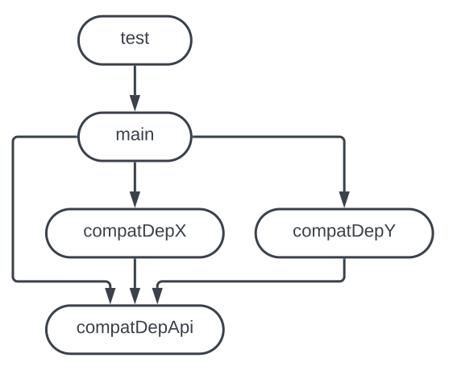
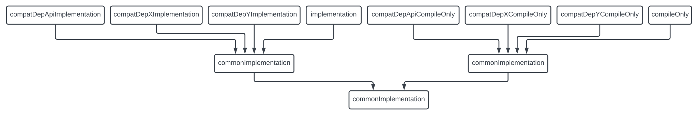

# Version Compatibility Gradle Plugin

## Overview and purpose

The plugin has two related but independent functions:

* Sets up source sets to create compatibility adapters for different versions of a dependency.
* Sets up a compatibility test suite against given versions of one or more dependencies.

This is useful in any context where the runtime dependencies of a program is a matter of configuration, e.g.
when integrating a 3rd party tool in a software suite.

It is compatible with Gradle 7.0 and up, and works with both Java and Kotlin.

There is a fully featured example under `example`, in case the documentation below is insufficient.

### Compatibility adapters

If a project is using a given dependency, but its actual version is provided during runtime, it is
sometimes necessary to write compatibility adapters if the possible versions have binary or functional
incompatibilities.

As an example, some dependency "dep" has three releases 1.0, 2.0 and 3.0, but only 1.0 and 2.0 are binary compatible.

```kotlin
plugins {
    id("io.github.davidburstrom.version-compatibility") version "0.1.0"
}

versionCompatibility {
    adapters {
        namespaces.register("Dep") {
            versions.set(listOf("1.0", "3.0"))
        }
    }
}

dependencies {
    "compatDep1Dot0CompileOnly"("dep:dep:1.0")
    "compatDep3Dot0CompileOnly"("dep:dep:3.0")
}
```

The plugin will create a few source sets: `compatDepApi`, `compatDep1Dot0` and `compatDep3Dot0`.
The `compatDepApi` source set should contain the interface through which the production code will call the
compatibility adapters, and the `compatDep1Dot0` and `compatDep3Dot0` source sets should contain the implementations of said adapters.
Those source sets depend on the output from `compatDepApi`, and the `main` source set depends on the output from all of them.
See the graph below for an overview:



The production code will have to select the proper adapter based on the runtime version of the dependency, for example
by resolving the version through the classpath, or provided as a configuration parameter.

It is recommended that the compat version for each source set is the *earliest* version the adapter supports, for consistency.

Since all source sets are likely to have some common dependencies, e.g. for SpotBugs annotations, etc., the plugin will
set up `commonImplementation` and `commonCompileOnly` configurations that the corresponding source set configurations depend on.
See the graph below for an overview:



### Compatibility test suites

In order to test that the production code works well with any given version of a dependency, the plugin
extension object is used to define which versions to pull in. In the example below, the plugin
defines three test tasks, `compatibilityTestWithMyDependency1Dot0`, `compatibilityTestWithMyDependency2Dot0`
and `compatibilityTestWithMyDependency3Dot0` respectively.

```kotlin
plugins {
    id("io.github.davidburstrom.version-compatibility") version "0.1.0"
}

versionCompatibility {
    tests {
        dimensions.register("myDependency") {
            versions.set(listOf("1.0", "2.0", "3.0"))
        }
        eachTestRuntimeOnly {
            addConstraint("my.dependency:dependency:${versions[0]}!!")
        }
        eachTestTask {
            // Optional, unless the test should verify which version is resolved.
            testTask.systemProperty("MY_DEPENDENCY_VERSION", versions[0])
        }
    }
}
```

The plugin will also create a lifecycle task called `compatibilityTest` which depends on all the compatibility test tasks.
As the tests may take a substantial time to execute depending on the efficiency of the test implementations and the
number of versions, it is not hooked up with the Gradle `check` or `build` lifecycle tasks by default.
Either execute the task on demand, or wire it up explicitly, e.g.

```
tasks.named("build").configure {
    dependsOn(tasks.named("compatibilityTest"))
}
```

In contexts where `'.'` and `'-'` characters are illegal, they will be replaced with `"Dot"` and `"Dash"` respectively.

In case there are multiple dimensions, e.g. if the test suite should run against different versions
of the JDK and the dependency, just add another `dimensions.register()` call. The plugin will generate
test tasks for each Cartesian product.

The compatibility tests can be run just like normal tests in IntelliJ.

## Releases

* 0.1.0 Initial release

## License

[](https://opensource.org/licenses/Apache-2.0)

Copyright 2022 David Burström.

## Future improvements

* Support older versions of Gradle: 5.3 and up should be possible, but it requires wiring up the extension properties manually.
* Support for adding bespoke dependencies to a compatibility test classpath.
* Support for isolated unit testing of the compatibility adapters.

